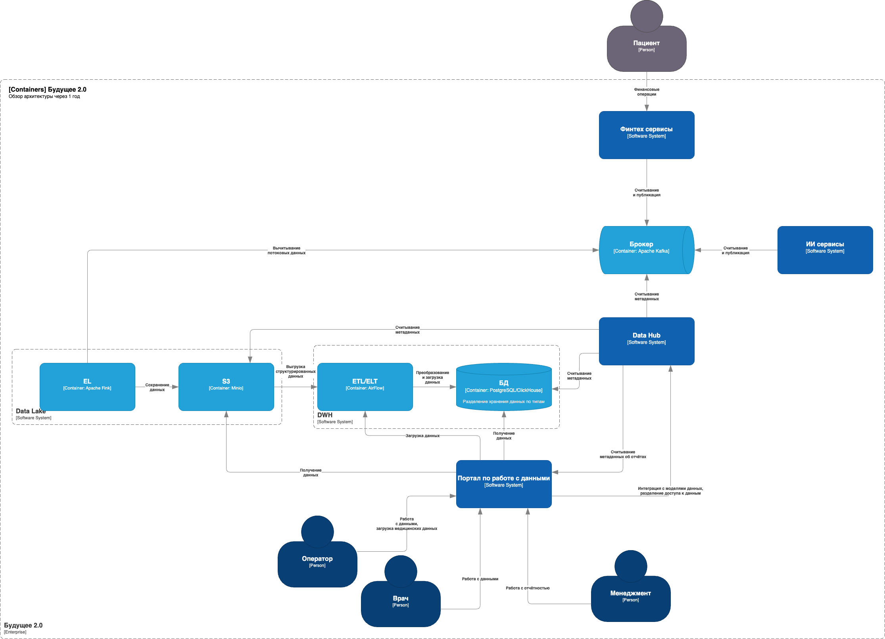

# Exc-1

# Диаграммы архитектуры компании через 1 год

## Диаграмма контекста

## Диаграмма контейнеров

## Проблемные места

1. Бизнес-логика реализованная на устаревшем DWH (MS SQL 2008), трудность в масштабировании и сложность поддержки, зависимость для развития. Как следствие жёсткая связность между бизнес-направлениями, проблемы с выделением независимых потоков данных. 
2. Сложные и медленные отчёты в BI, длительное выполнение (часы), отсутствие оперативного доступа к реальным данным. Высокая нагрузка на DWH из-за отчётов.
3. Интеграционная шина на Apache Camel. Устаревшее решение с недостаточной пропускной способностью, что будет ограничивать потенциал роста при развитии сервисов компании. Отсутствие потоковой обработки.
4. Нет удобного самообслуживания при работе с данными для пользователей.

## Приоритезация выявленных проблем по методу MoSCoW

### Must Have:

1. Монолитный DWH на MS SQL 2008 - переход на масштабируемый и более современный PostgreSQL для хранения структурированных данных, для колоночных данных использовать ClickHouse. Мигрировать данные. Вынести бизнес-логику на уровень сервисов.
2. Заменить шину на более производительную с асинхронной обработкой данных (Kafka).

### Should Have:

1. Жёсткая связность между бизнес-направлениями - развязать зависимости между потоками данных, отсустствие инструмента по управлению данными. Рассмотреть подход Data Mesh с разделением данных по доменам.
2. Сложные и медленные отчёты в BI. Разработать портал по управлению данными.

### Could Have:

1. Отсутствует поддержка обработки неструктурированных и полуструктурированных, потоковых данных. В дополнение к DWH рассмотреть внедерение Data Lake, либо комбинированное Data LakeHouse.