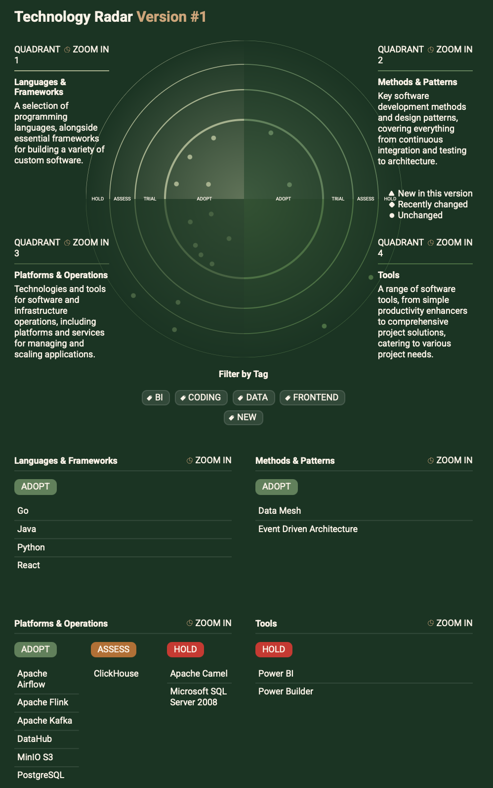
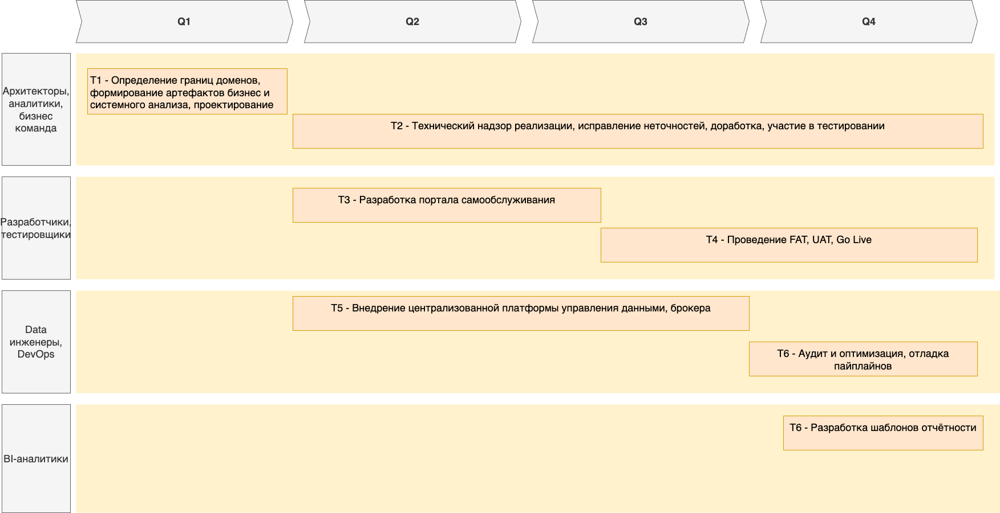

# Exc-3

## Технологический радар

## Технологический роадмап

Помимо планов компании по развитию и имеющихся проблем при масштабировании, также будем использовать модель Time для оценки пригодности существующих технологий:

| Приложение / Система                       | Оценка (T/I/M/E) | Обоснование                                                                                                                        |
|--------------------------------------------|------------------|------------------------------------------------------------------------------------------------------------------------------------|
| DWH (MS SQL Server 2008)                   | Migrate          | Устарело, плохо масштабируется, сложно поддерживать. Нужно мигрировать на более современные аналоги.                               |
| Power BI                                   | Migrate          | Широко используется бизнесом, улучшится с интеграцией DataHub и DataLake. Но как целевое рассматриваем портал по работе с данными. |
| Power Builder                              | Eliminate        | Устаревший стек, сложно поддерживать. Лучше заменить на современный UI.                                                            |
| Apache Camel (Шина интеграции)             | Migrate          | Устарело, сложное управление, низкая гибкость. Лучше перейти на Kafka особенно с учётом роста бизнеса и масштабирования.           |
| Финтех-сервисы (Golang, Java)              | Invest           | Критично для бизнеса, хорошо масштабируется. Требуется интеграция с DataLake.                                                      |
| ИИ-сервисы (Python)                        | Invest           | Развивающийся домен. Необходимо улучшить доступ к данным через DataLake.                                                           |
| DataHub (новое решение)                    | Invest           | Ключевая часть новой архитектуры, обеспечит управление метаданными, контроль доменами своих данных.                                |
| Портал по работе с данными (новое решение) | Invest           | Разгружает DWH, дает пользователям гибкость в создании отчетов, интегрируется с DataHub.                                           |

План по миграции на новые технологии в разрезе года:

